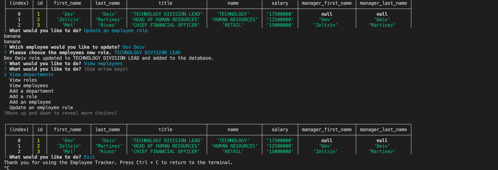

# didactic-octo-lamp-employee-tracker
# Employee Tracker
  
  
  ## Table of Contents ##
  *[Description](#description)

  *[License](#license)

  *[Languages](#languages)

  *[Installation](#installation)

  *[Usage](#usage)

  *[Contributing](#contributing)

  *[Questions](#questions)

## Link to Video Walkthrough ##
https://drive.google.com/file/d/1SED6sCFwifLqCK202V7e9cPZp0l5GfLA/view

  ## Description ##
  A command line application that uses MySQL2 and Inquirer in order to create a database for an employer that keeps track of their departments, roles, and employees. It also allows the option of viewing said options, as well adding a department, role and employee. Also allows for the option to update an existing employee!
  

  ## License ##
  This is licensed under MIT
  

  ## Installation ##
  npm i

  ## Tests ##
  npm test

  ## Usage ##
  There's code in here!

  ## Contributing ##
  Feel free to give feedback or make it better!

  ## Questions ##
  Github: [DEIVRS60](https://github.com/DEIVRS60)

  Email: david.reyes095@gmail.com

  
